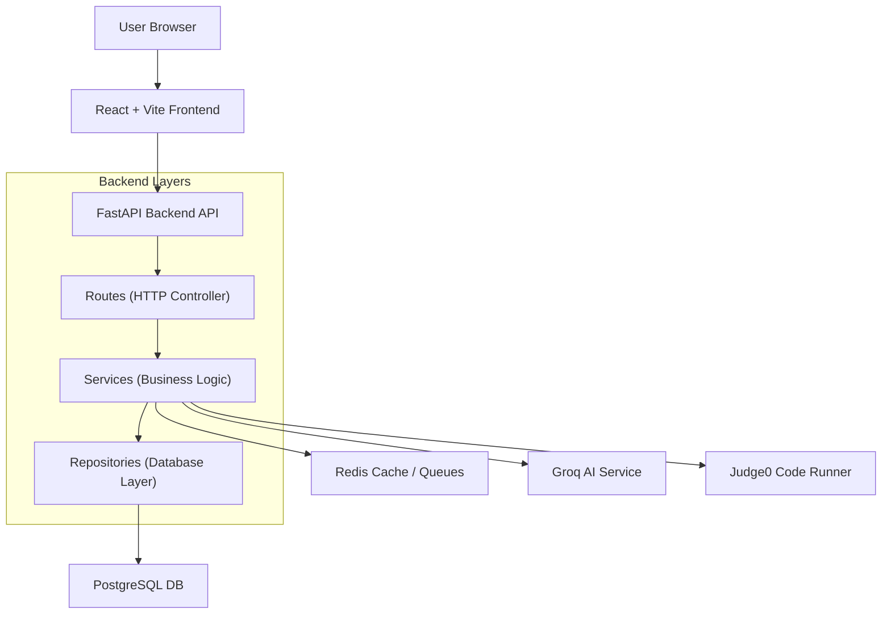
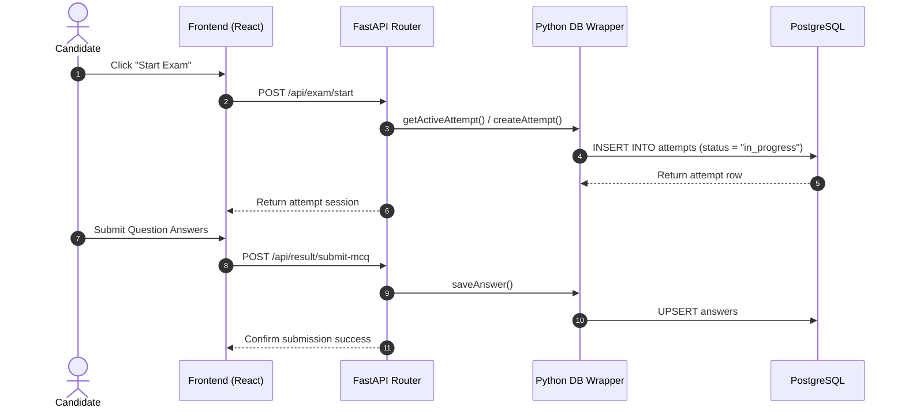
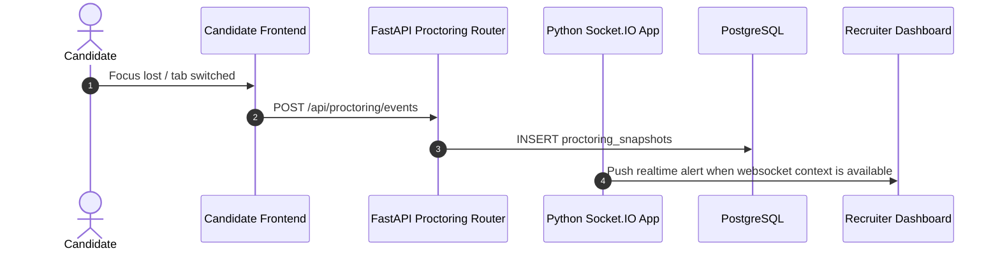

# IntelliHire Architecture

## System Overview

IntelliHire is a full-stack recruitment examination platform with four user roles: Admin, TPO, Recruiter, and Candidate.

## Backend Architecture

The active backend lives in `server_py/app`. It is organized around FastAPI routers, shared helper modules, and a PostgreSQL compatibility wrapper that preserves the Supabase-style query pattern used by the earlier TypeScript code.

1. **Routers (HTTP Layer)**:
   - Handle incoming requests (validate inputs, verify route access, extract path/query variables).
   - Direct work to helper functions or route-local workflows.
   - Raise FastAPI `HTTPException` errors for consistent HTTP status handling.
2. **Domain Helpers**:
   - Contain the core business rules, calculations, AI scoring pipeline invocations, and integrations.
   - Include modules such as `ai.py`, `compiler.py`, `insights.py`, `plagiarism.py`, and `utils.py`.
3. **Database Layer**:
   - `server_py/app/db.py` owns PostgreSQL connection pooling and Supabase-style select/upsert/filter compatibility.
   - Raw SQL is still used in a few high-shape analytics paths where it is clearer.

---

## Detailed Data Flows

### 1. Candidate Exam Attempt Flow

### 2. Real-Time Proctoring & Websocket Synchronization

---

## Security Controls

- **Encryption**: Passwords hashed using standard `bcrypt` algorithms.
- **Session Tokens**: REST routes and websocket handshakes authenticated via JSON Web Tokens (JWT).
- **Access Control**: Role-based access control (RBAC) middleware verifying user authorizations (Candidate, Recruiter, TPO, Admin).
- **Environment Isolation**: Database URLs, JWT secrets, and API credentials stored securely in environment configurations.

