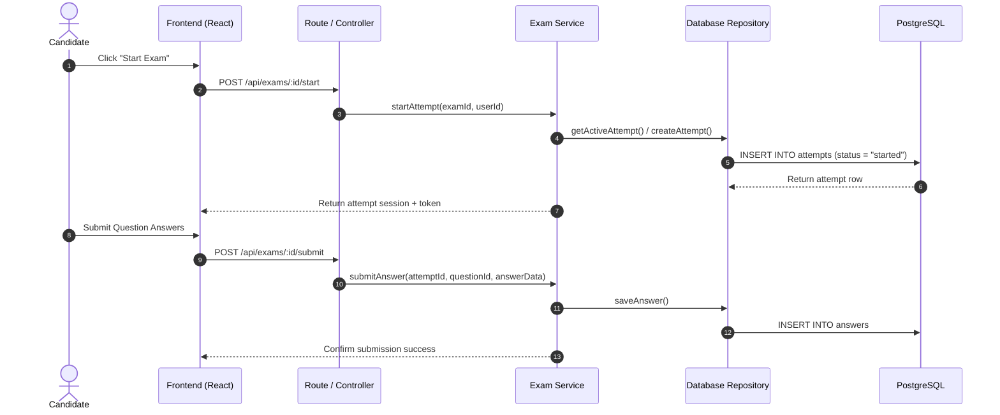
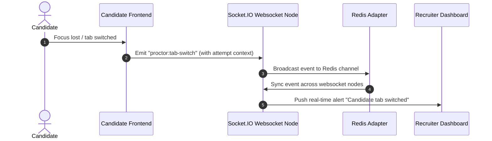

# IntelliHire Architecture

## System Overview

IntelliHire is a full-stack recruitment examination platform with four user roles: Admin, TPO, Recruiter, and Candidate.

## 3-Layer Backend Architecture

To maintain clean codebase separation and adherence to the Single Responsibility Principle, we organize our backend code into three specialized layers:

1. **Routes (HTTP Layer)**:
   - Handle incoming requests (validate inputs, verify route access, extract path/query variables).
   - Direct work to the appropriate Service and return the HTTP response envelope.
   - Forward errors cleanly using the Express centralized error handler `next(err)`.
2. **Services (Business Logic)**:
   - Contain the core business rules, calculations, AI scoring pipeline invocations, and integrations.
   - Orchestrate calls to multiple repository methods or helper utilities.
   - Throw semantic custom errors (e.g. `ValidationError`, `NotFoundError`).
3. **Repositories (Database Layer)**:
   - The sole location for SQL query builders and direct database connection pool queries.
   - Handle tables mapping, schema transformations, and direct record CRUD.

---

## Detailed Data Flows

### 1. Candidate Exam Attempt Flow

### 2. Real-Time Proctoring & Websocket Synchronization

---

## Security Controls

- **Encryption**: Passwords hashed using standard `bcrypt` algorithms.
- **Session Tokens**: REST routes and websocket handshakes authenticated via JSON Web Tokens (JWT).
- **Access Control**: Role-based access control (RBAC) middleware verifying user authorizations (Candidate, Recruiter, TPO, Admin).
- **Environment Isolation**: Database URLs, JWT secrets, and API credentials stored securely in environment configurations.

