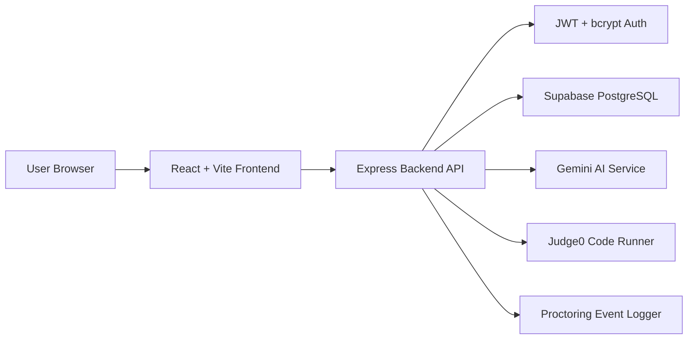

# IntelliHire Architecture

## System Overview

IntelliHire is a full-stack recruitment examination platform with four user roles: Admin, TPO, Recruiter, and Candidate.

## Main Modules

| Module | Responsibility |
| --- | --- |
| Authentication | Login, JWT generation, password hashing, protected routes |
| Admin | Manage recruiters, TPOs, colleges, and platform analytics |
| TPO | Manage students, verification, and college reports |
| Recruiter | Create exams, drives, question banks, assignments, and review results |
| Candidate | Onboarding, exam attempt, results, certificates, and interview flow |
| Proctoring | Camera checks, snapshots, warning count, and recruiter review |
| AI | Question generation, marksheet scanning, and AI interview/evaluation support |
| Compiler | Coding question execution and test-case scoring |

## Data Flow

1. User logs in through the frontend.
2. Backend validates credentials using bcrypt password comparison.
3. Backend returns a JWT token and role details.
4. Frontend uses the token for protected API requests.
5. Backend checks role permissions before serving protected resources.
6. Exam answers, code submissions, proctoring events, and results are stored in Supabase.

## Security Controls

- Passwords are stored as bcrypt hashes.
- JWT tokens protect backend API routes.
- Role middleware restricts admin, recruiter, TPO, and candidate routes.
- Exam-management routes are limited to recruiter/admin access.
- Candidate answer submission verifies attempt ownership.
- Sensitive keys remain in `.env` and backend-only.

